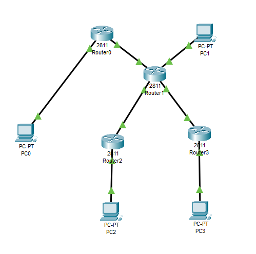
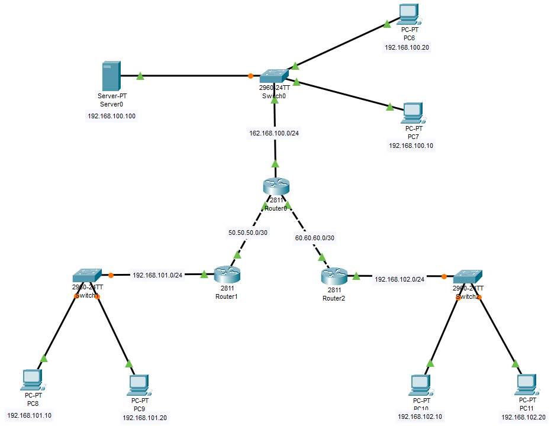

# Network Security Lab — Cisco Packet Tracer
Hands-on network configuration and security implementation exercises using Cisco Packet Tracer (Cisco 2811 Routers & 2960-24TT Switches).
## Lab 1 — Multi-Router Network Topology

Topology Overview:

A hierarchical network design featuring a central hub router (Router1/2811) interconnected with 3 branch routers (Router0, Router2, Router3), each serving an end-host PC (PC0–PC3). Router1 also directly connects to PC1.
Devices Used: 4 × Cisco 2811 Router · 4 × PC
Skills Demonstrated: Router interconnection · Static/dynamic routing · Multi-segment network design

## Lab 2 — IPsec VPN Configuration (Multi-Site Network)

Topology Overview:

A three-site enterprise network with a central hub site (Router0) connected to two branch sites (Router1 — 192.168.101.0/24, Router2 — 192.168.102.0/24) via WAN point-to-point links (50.50.50.0/30 and 60.60.60.0/30). The hub site hosts a server (192.168.100.100) and end clients (PC6: 192.168.100.20, PC7: 192.168.100.10) connected via Switch0 (2960-24TT). Branch sites connect end clients through Switch1 and Switch2.
IPsec VPN secured the WAN links between:

Router0 ↔ Router1 via 50.50.50.0/30

Router0 ↔ Router2 via 60.60.60.0/30
Devices Used: 3 × Cisco 2811 Router · 3 × Cisco 2960-24TT Switch · 1 × Server · 6 × PC
Skills Demonstrated: IPsec VPN configuration · IKE Phase 1 & 2 · Crypto map · ACL-based interesting traffic · Multi-site routing · WAN point-to-point links

## Tools Used

Cisco Packet Tracer · IPsec · IKE · VPN · ACL · Static Routing
